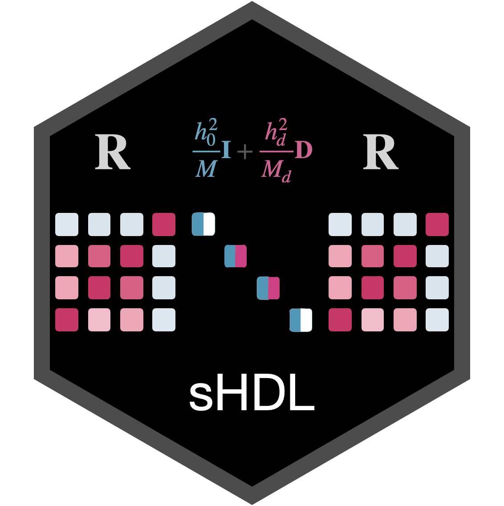

# Stratified high-definition likelihood inference of heritability enrichment 

<br>


## Installation 

To install the latest version of `sHDL` package via Github, run the following commands in `R`:

```R
# install required packages
install.packages(c("RhpcBLASctl", "dplyr", "parallel"))
remotes::install_github("now2024/sHDL")
```

## Required input data

- `D`, is a vector of genomic annotations with vector names of SNP IDs.
- `gwas.df`, is a GWAS summary statistics of genetic variants for a specific trait. For description of the format of summary statistics, please refer to [this wiki page from HDL](https://github.com/zhenin/HDL/wiki/Format-of-summary-statistics).

- The eigenvalues and eigenvectors of LD matrices from `HDL`, refer to the [instruction](https://github.com/zhenin/HDL/wiki/Reference-panels) in the [HDL wiki](https://github.com/zhenin/HDL/wiki).

## Quick vignette

```R
remotes::install_github("zhenin/HDL/HDL")
data(gwas1.example, package='HDL')

library(sHDL)

## The GWAS summary statistics for birth weight loaded from HDL package.
M <- nrow(gwas1.example)
set.seed(1234)
D <- rbinom(M, 1, 0.01) # random D vector
names(D) <- gwas1.example$SNP

## The path to the directory where linkage disequilibrium (LD) information is stored.
LD.path <- "path/to/UKB_array_SVD_eigen90_extraction"

## To speed up the test, we set a large lam.cut value.
res.sHDL <- sHDL(D, gwas1.example, LD.path, nthreads=1, stepwise=TRUE, lam.cut=10, Dr.path="./Dr", verbose=F)
print(as.data.frame(res.sHDL))

system("rm -rf ./Dr") # remove the Dr directory
```

For more detailed help in `R`

```R
?sHDL
```

## More detailed tutorial

For more detailed tutorial please go to [this example](https://now2014.github.io/sHDL/articles/Example.html).

## Citation

If you use the `sHDL` software, please cite:

[Ning, Z., Pawitan, Y. & Shen, X. High-definition likelihood inference of genetic correlations across human complex traits. *Nat Genet* (2020)](https://www.nature.com/articles/s41588-020-0653-y).

Lan A. and Shen X. Modeling the genetic architecture of complex traits via stratified high-definition likelihood. (2024).

## Contact

Reporting bugs by opening a new issue on this [Github page](https://github.com/now2014/sHDL/issues).

Sending email to authors:  [Ao Lan](mailto:lanao@mail2.sysu.edu.cn) or [Xia Shen](mailto:shenx@fudan.edu.cn).

## Future plan

This repository will be integrated into the [HDL](https://github.com/zhenin/HDL) software in the future.